# Deployment Example

- create a web application for Thai text analysis, e.g. tokenization, word embeddings

Free Hosting Services

- [AWS Lambda](https://aws.amazon.com/pm/lambda/) - FaaS (Function as a Service) type cloud computing 
- [AWS Elastic Beanstalk](https://docs.aws.amazon.com/elastic-beanstalk/)
- [Render](https://dashboard.render.com/) - PaaS (Platform as a Service) type cloud computing 
- [Pythonanywhere]()
- [Streamlit]()

## Create virtual environment

- for testing the application on your local computer
- you don't have to upload the folder `my_env` on GitHub

~~~bash
$ cd XX/XX  ## change directory 
$ python3 -m venv my_env  ## create virtual environment
$ source my_env/bin/activate  ## activate virtual environment 
(my_env) $ pip install flask gensim pythainlp gunicorn ## install libaries
~~~

write the list of packages to `requirements.txt`

~~~bash
(my_env) $ pip freeze > requirements.txt
~~~

~~~
certifi==2023.11.17
charset-normalizer==3.3.2
click==8.1.7
Flask==2.0.0
gensim==4.1.0
gunicorn==20.0.0
...
~~~

## Prepare files

- create a web application by using `Flask`
- see `app.py` and `templates/**.html` and [Flask documentation](https://flask.palletsprojects.com/en/3.0.x/quickstart/)

~~~
(root directory)/
　├ my_env/  ## virtual environment
　├ static/
　│　└ thairath_wv.bin  ## pre-trained word embeddings for gensim
　├ templates/
　│　├ layout.html
　│　├ tokenization.html
　│　└ wv.html
　├ requirements.txt  ## list of python packages
　├ run.sh  ## shell script 
　├ .gitignore  
　└ app.py  ## main program
~~~

## Run on local machine

~~~bash
$ source my_env/bin/activate  ## activate virtual environment
(my_env) $ python app.py
 * Serving Flask app 'app'
 * Debug mode: on
WARNING: This is a development server. Do not use it in a production deployment. Use a production WSGI server instead.
 * Running on all addresses (0.0.0.0)
 * Running on http://127.0.0.1:8000
~~~

> tokenization page

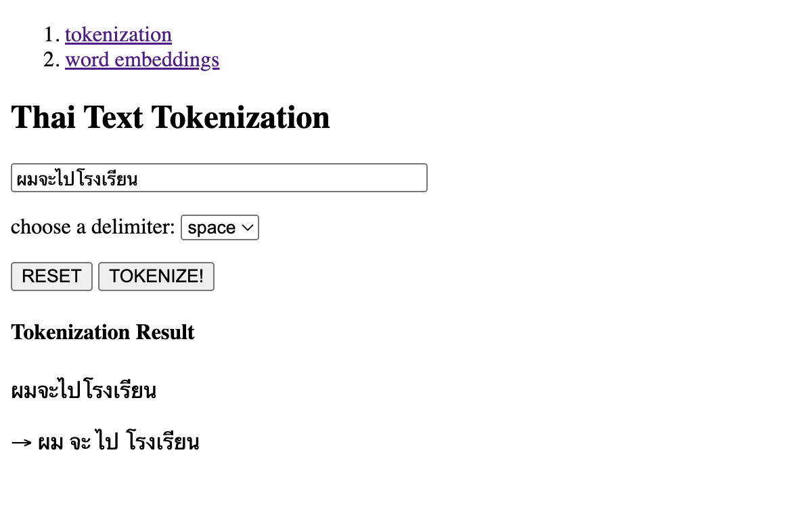

> word embedding page

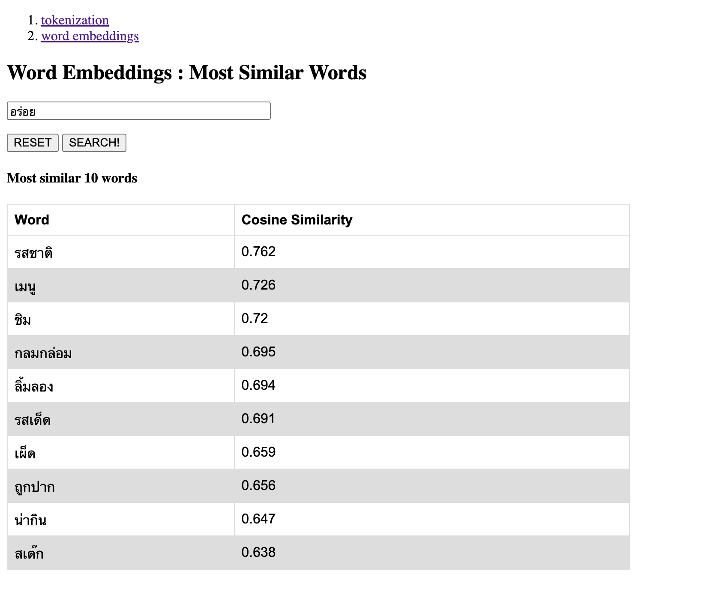

## How to deploy

### Render

=== NOTION ===

version of python in Render is `3.7.10`, thus you have to install older version of libiralies in your virtual environment. 

~~~bash
$ cd XX/XX  ## change directory 
$ python3 -m venv my_env  ## create virtual environment
$ source my_env/bin/activate  ## activate virtual environment
(my_env) $ pip install flask==1.1 gensim==4.0 pythainlp==2.2 gunicorn==20.0 ## install libaries
(my_env) $ pip freeze > requirements.txt  ## install libaries
~~~

##### 1. go to page and sign up with GitHub account

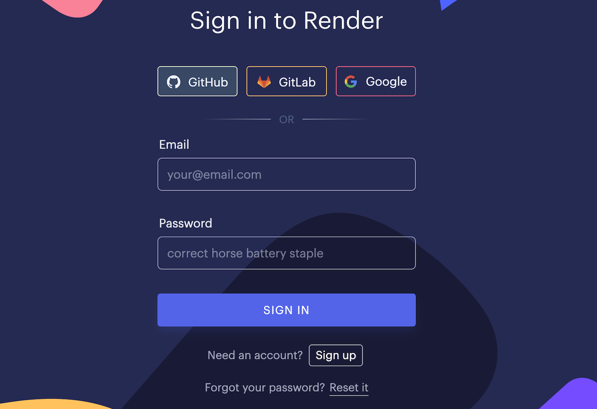 

##### 2. select `Web Services`

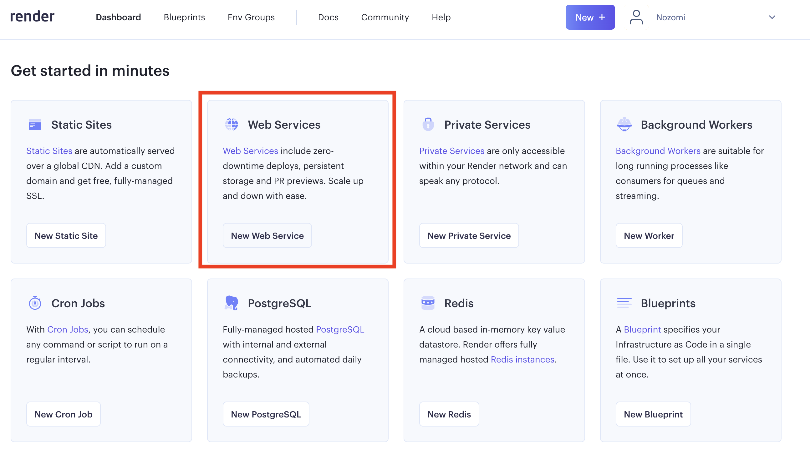 

##### 3. select `Build and deploy from a Git repository`

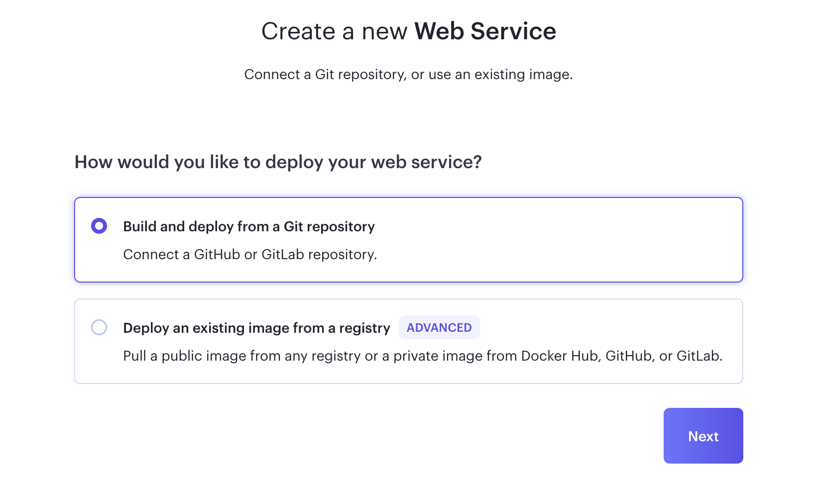 

##### 4. click `Connect Repository`

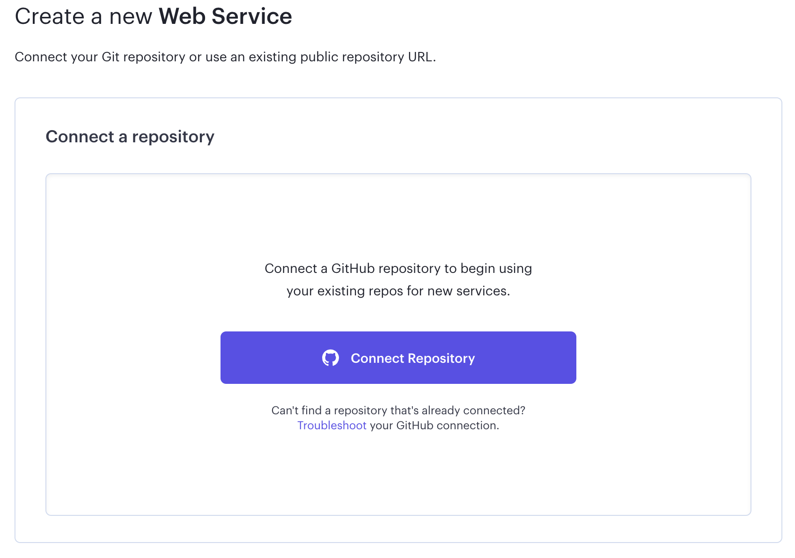 

##### 5. select repository > `install`

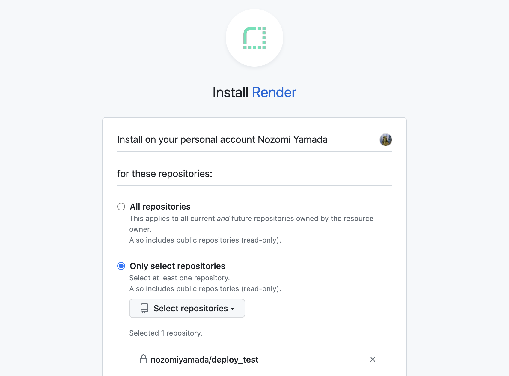 

##### 6. click `connect`

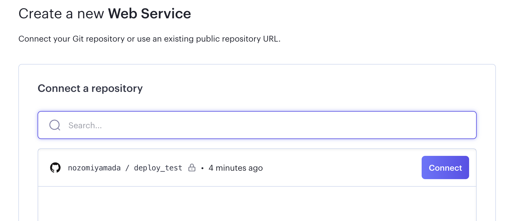 

##### 7. application setting 

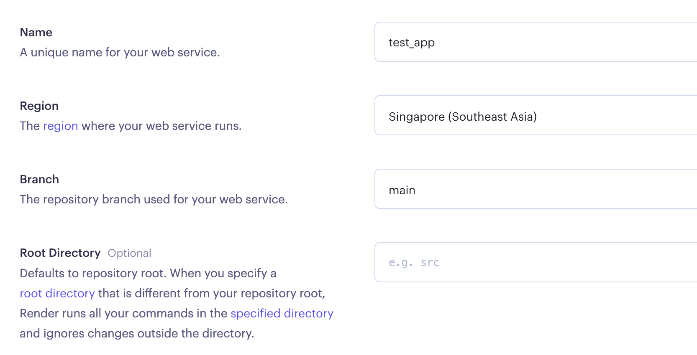 

- set `Build Command` as `pip install -r requirements.txt`
- set `Start Command` as `gunicorn app:app --bind=0.0.0.0:8000`

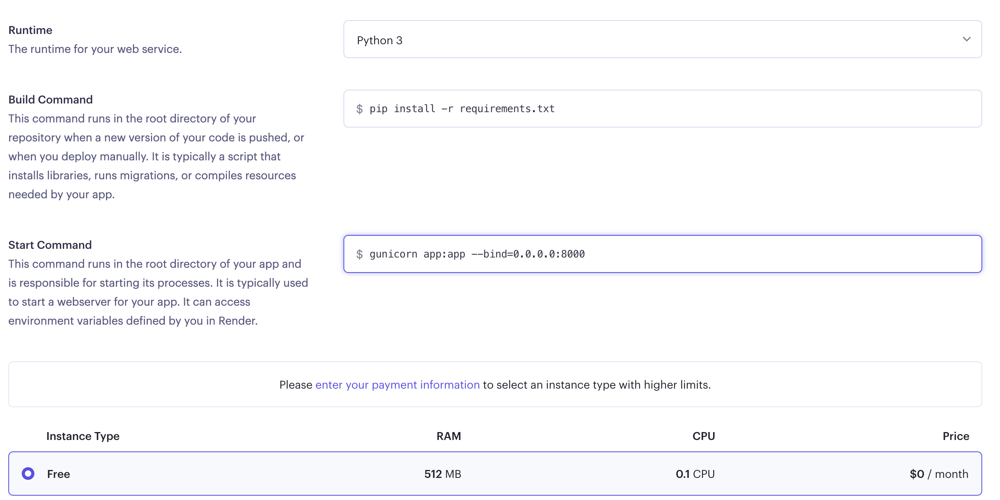 

#### 2. AWS Lambda

##### 1. install `zappa` and `awscli`

~~~bash
(my_env) $ pip install zappa awscli
~~~

##### 2. create AWS access key

- click account name, go `security credentials` > `Create access key`

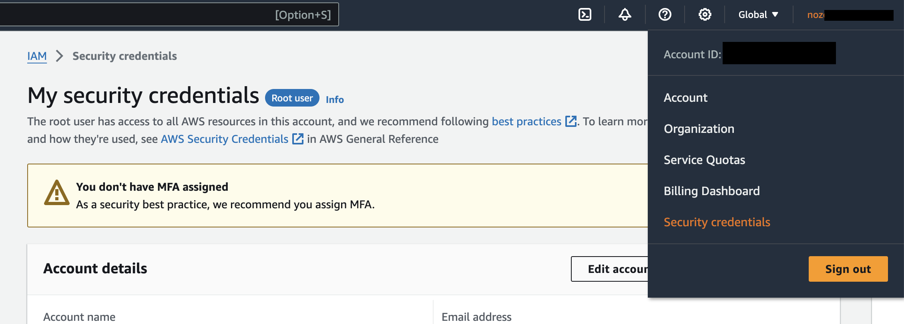
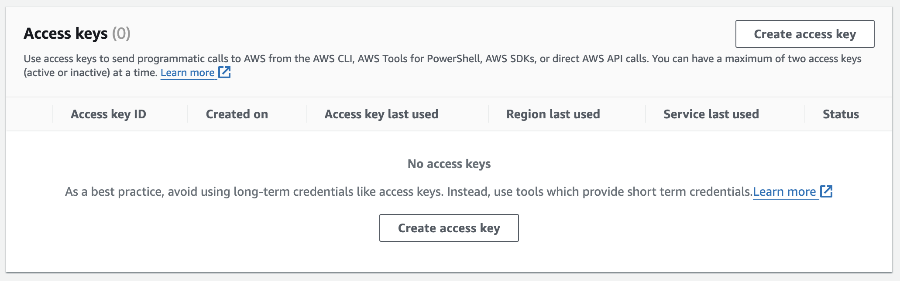

- never forget to record (or download) two access keys

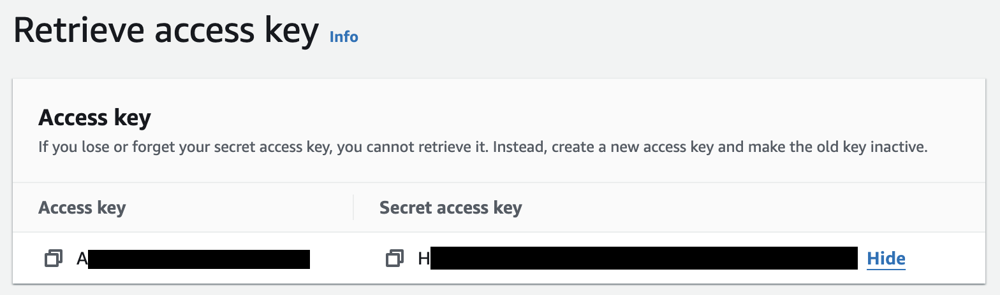

- open terminal and input these two access keys

~~~bash
$ aws configure
$ AWS Access Key ID [None]: A---------------
$ AWS Secret Access Key [None]: H--------------
$ Default region name [None]:
$ Default output format [None]:
~~~

- go to AWS Lambda and check your region

![]

##### 3. setting for `zappa`

create `zappa_settings.json`

~~~json
{
    "dev": {
        "app_function": "app.app",
        "aws_region": "us-east-2",
        "profile_name": "default",
        "project_name": "deploy-test",
        "runtime": "python3.9",  ## select your python version
        "s3_bucket": "zappa-mybucket"
    }
}
~~~

