# Deployment Example

- create a web application for Thai text analysis, e.g. tokenization, word embeddings

Free Hosting Services

- [Render](https://dashboard.render.com/) - PaaS (Platform as a Service) type cloud computing 
- [Pythonanywhere]()
- [AWS Lambda](https://aws.amazon.com/pm/lambda/) - FaaS (Function as a Service) type cloud computing 
- [AWS Elastic Beanstalk](https://docs.aws.amazon.com/elastic-beanstalk/)

- [Streamlit]()

## Create virtual environment

- for testing the application on your local computer
- you don't have to upload the folder `my_env` on GitHub

~~~bash
$ cd XX/XX  ## change directory 
$ python3 -m venv my_env  ## create virtual environment
$ source my_env/bin/activate  ## activate virtual environment 
(my_env) $ pip install flask gensim pythainlp gunicorn ## install libaries
~~~

=== NOTION ===

version of Python in **Render** is `3.7.10`, thus we have to install Python 3.7 and older version of libiralies in the virtual environment.

~~~bash
$ cd XX/XX  ## change directory 
$ python3.7 -m venv my_env  ## create virtual environment
$ source my_env/bin/activate  ## activate virtual environment
(my_env) $ pip install flask gensim pythainlp gunicorn ## install libaries
~~~

write the list of packages to `requirements.txt`

~~~bash
(my_env) $ pip freeze > requirements.txt
~~~

~~~
backports.zoneinfo==0.2.1
certifi==2023.11.17
charset-normalizer==3.3.2
click==8.1.7
Flask==2.2.5
gensim==4.2.0
gunicorn==21.2.0
numpy==1.21.6
pythainlp==4.0.2
requests==2.31.0
scipy==1.7.3
...
~~~

## Prepare files

- create a web application by using `Flask`
- see `app.py`, `templates/**.html` and [Flask documentation](https://flask.palletsprojects.com/en/3.0.x/quickstart/)

~~~
(root directory)/
　├ my_env/  ## virtual environment
　├ static/
　│　└ thairath_wv.bin  ## pre-trained word embeddings for gensim
　├ templates/
　│　├ layout.html
　│　├ tokenization.html
　│　└ wv.html
　├ requirements.txt  ## list of python packages
　├ .gitignore  
　└ app.py  ## main program
~~~

## Run on local machine

~~~bash
$ source my_env/bin/activate  ## activate virtual environment
(my_env) $ python app.py
 * Serving Flask app 'app'
 * Debug mode: on
WARNING: This is a development server. Do not use it in a production deployment. Use a production WSGI server instead.
 * Running on all addresses (0.0.0.0)
 * Running on http://127.0.0.1:8000
~~~

> **tokenization page**

 

> **word embedding page**

 

## How to deploy

- [Render](#render)
- [Python Anywhere](#python-anywhere)

### Render

URL : https://render.com/
WEBAPP EXAMPLE : https://test-app-r6km.onrender.com/

It's easiest website to deploy python application. All we have to do is push python programs to GitHub repository. After that, the website will update program automatically.  

Render gives 750 hours free tier per month (only one application). 

The program will pause if there is no request for 15 minutes. Therefore, there may be a delay in accessing the web page after restarting the application.

#### 1. go to page and sign up with GitHub account

 

#### 2. select `Web Services`

 

#### 3. select `Build and deploy from a Git repository`

 

#### 4. click `Connect Repository`

 

#### 5. select repository > `install`

 

#### 6. click `connect`

 

#### 7. application setting 

 

- set **Build Command** as `pip install -r requirements.txt`
- set **Start Command** as `gunicorn app:app --bind=0.0.0.0:8000`

 

#### 8. deploy

start deployment. If error happens, `Manual Deploy` > `Deploy latest commit` after fixing the error and pushing to GitHub 

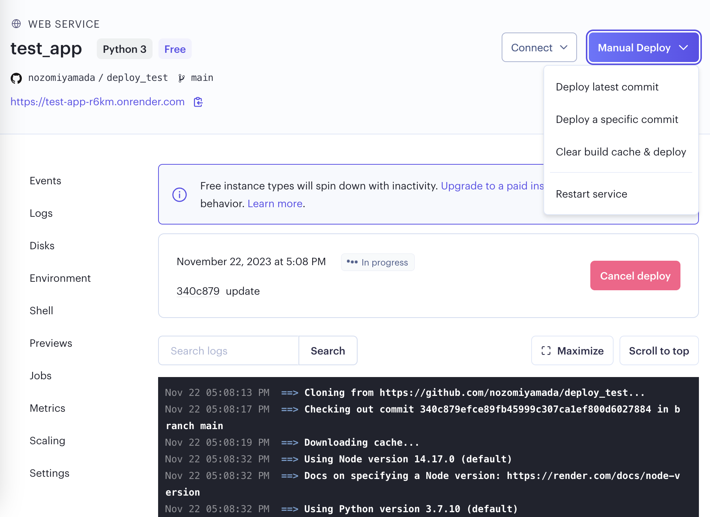 

### Python Anywhere

URL : https://www.pythonanywhere.com/
WEBAPP EXAMPLE : https://nozomiyamada.pythonanywhere.com/

Python Anywhere is another type of hosting service. Not only uploading files, but also this website allows us to directly edit Python files from _literally_ anywhere. In other words, we can create web application without setting up virtual environment on local machine. (But of course, it is more convenient to test programs on local environment.)

In addition, Python Anywhere offers various versions of Python from 3.6 to 3.10. It is easier to correspond your local environment.

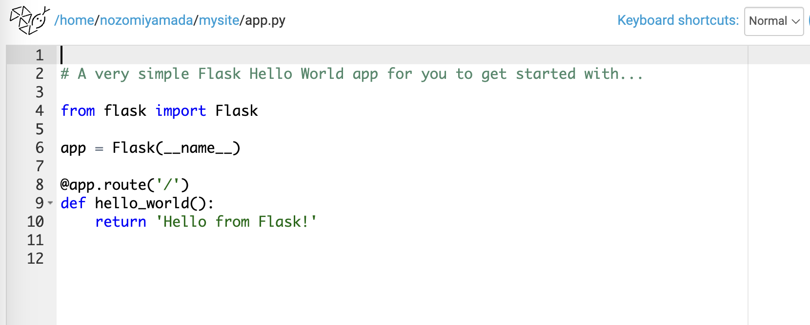 

_Documentations_ : 

- Setting up Flask applications on PythonAnywhere_
https://help.pythonanywhere.com/pages/Flask/

#### 1. click  `Start running Python online less than a minute`

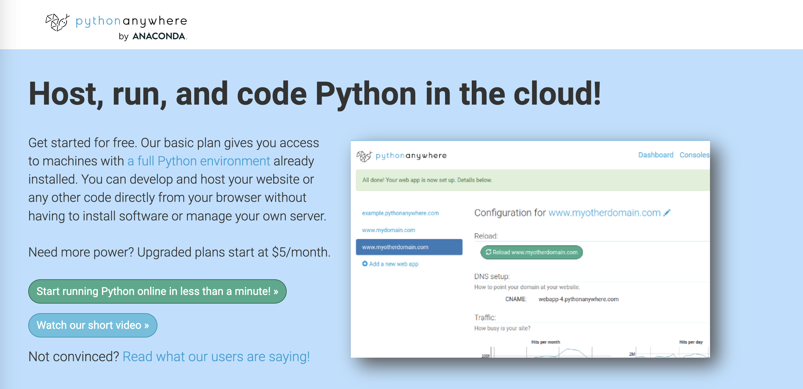 

#### 2. click  `Create a Beginner account`

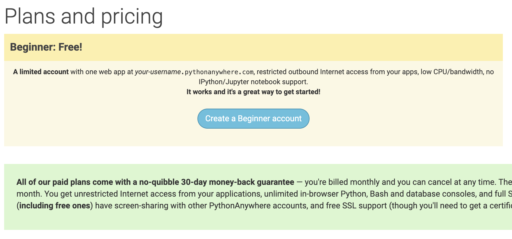 

#### 3. go to `Files` menu and upload all files

- to `/home/<YOURNAME>/mysite`
- need not upload virtual environment folder `my_env`

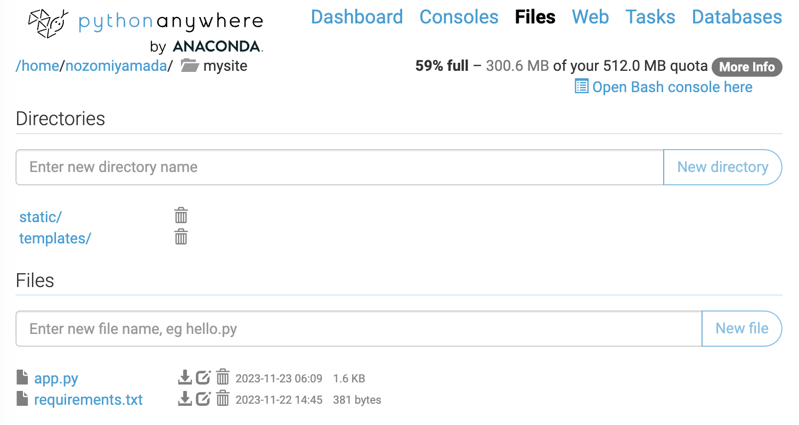 

before upload `app.py`, edit here:

~~~python
if __name__ == "__main__":
    app.run() # <= app.run(host="0.0.0.0", port=8000, debug=True)
~~~

or you can edit the file in web browser

#### 4. go to `Consoles` menu and select `Bash`

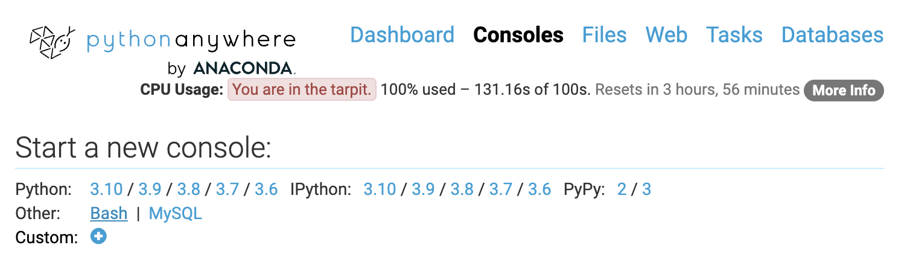 

#### 5. create virtual environment and `pip install`

see also : [documentaion](https://help.pythonanywhere.com/pages/Flask/)

~~~bash
~ $ mkvirtualenv --python=/usr/bin/python3.8 my_env
~~~

it is created in `/home/<YOURNAME>/.virtualenvs/my_env` and activated automatically

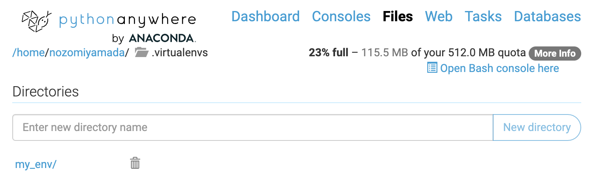 

~~~bash
(my_env) ~ $ pip install -r mysite/requirements.txt 
~~~

#### 6. go to `Web` menu and click `Add a new web app`

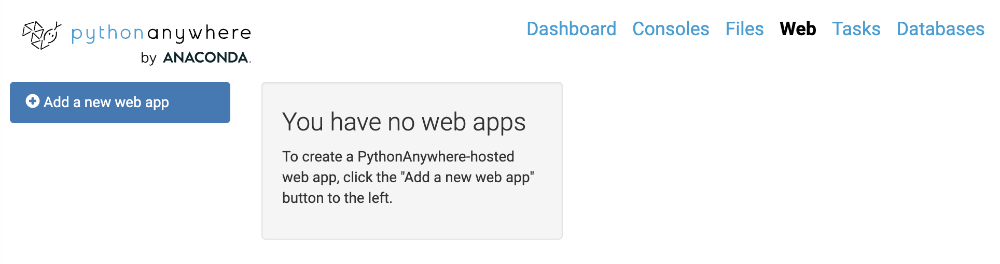 

select `Flask` and correspondent Python version

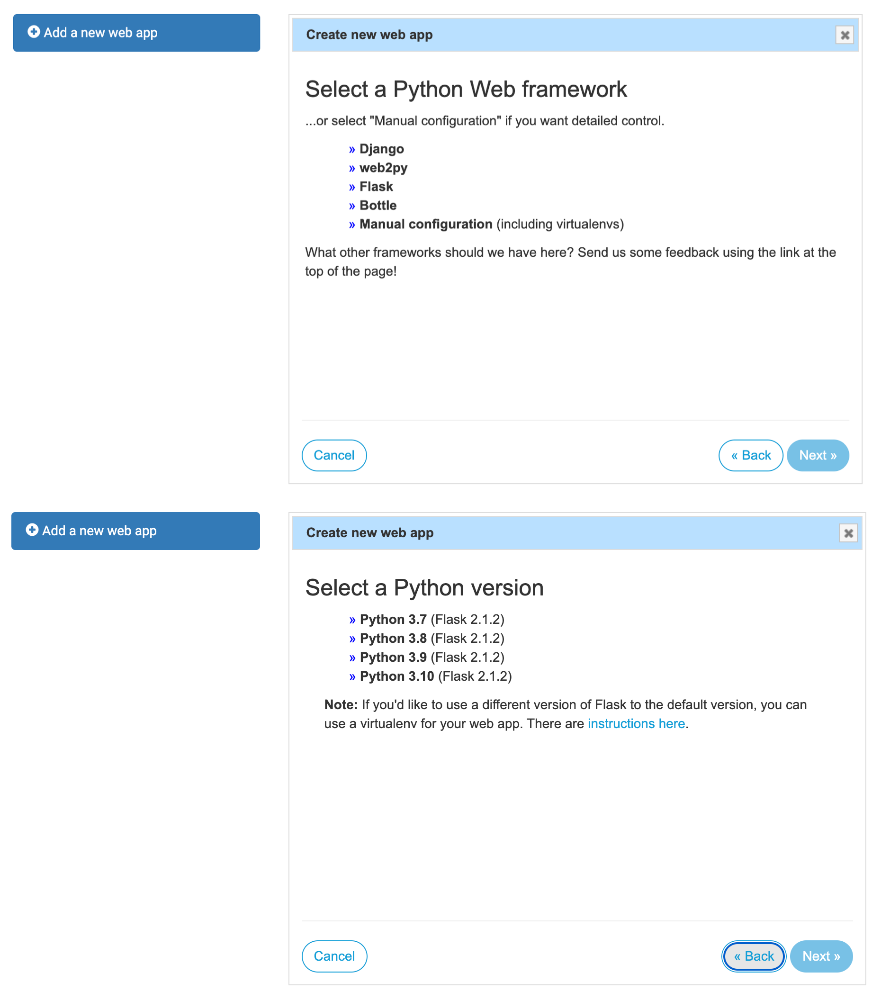 

Quickstart new Flask project. It creates new flask project named `flask_app.py`, but we don't use

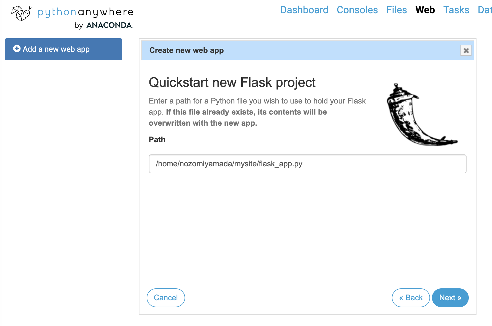 

#### 7. configure web app

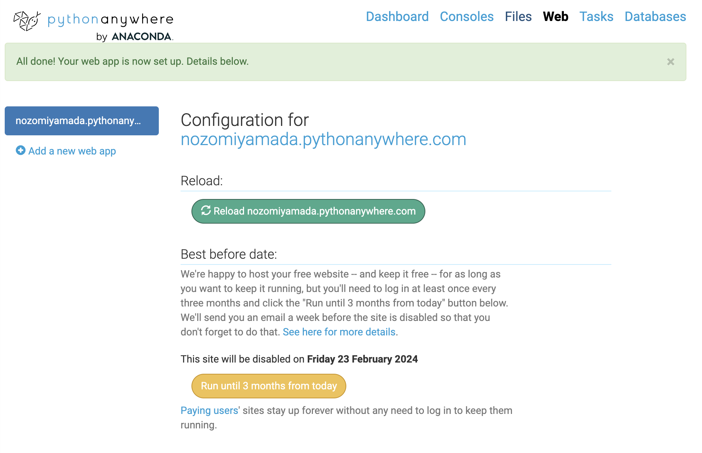 

scroll down to `Code`

- Source code: `/home/<YOURNAME>/mysite/app.py`
- Working directory: `/home/<YOURNAME>/mysite`
- Virtualenv: `/home/<YOURNAME>/.virtualenvs/my_env`

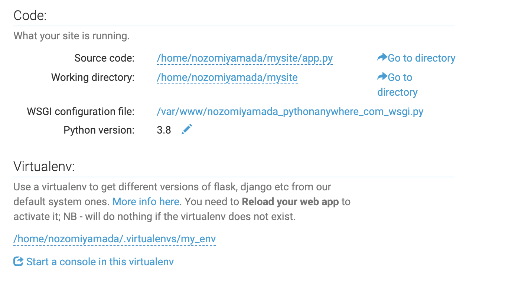 

for `WSGI configuration file`, edit `project_home` and the last row as `from app import app`

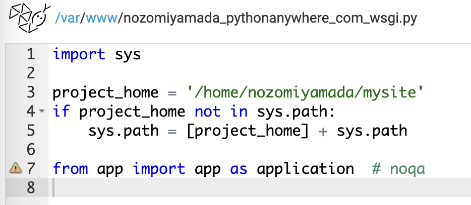 

~~~python
import sys

project_home = '/home/nozomiyamada/mysite'
if project_home not in sys.path:
    sys.path = [project_home] + sys.path

from app import app as application 
~~~

scroll down to `Static files`

- URL: `/static/` and Directory: `/home/<YOURNAME>/mysite/static`
- URL: `/templates/` and Directory: `/home/<YOURNAME>/mysite/templates`

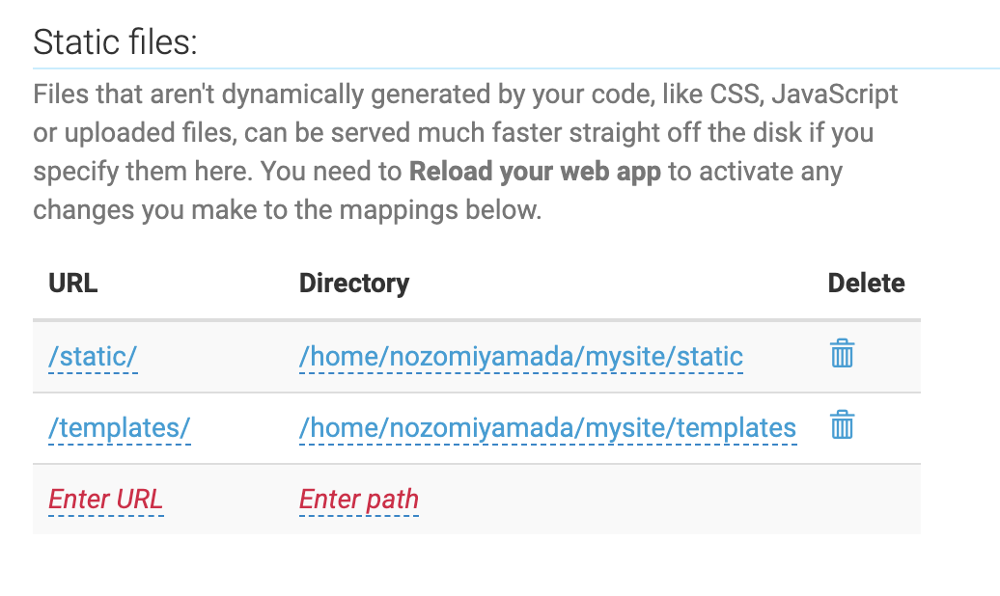 

go up and click `Reload xxx.pythonanywhere.com`

 

if no error occurs, you can access your website:

https://nozomiyamada.pythonanywhere.com/

### AWS Lambda

#### 1. install `zappa` and `awscli`

~~~bash
(my_env) $ pip install zappa awscli
~~~

#### 2. create AWS access key

- click account name, go `security credentials` > `Create access key`

- never forget to record (or download) two access keys

- open terminal and input these two access keys

~~~bash
$ aws configure
$ AWS Access Key ID [None]: A---------------
$ AWS Secret Access Key [None]: H--------------
$ Default region name [None]:
$ Default output format [None]:
~~~

- go to AWS Lambda and check your region

#### 3. setting for `zappa`

create `zappa_settings.json`

~~~json
{
    "dev": {
        "app_function": "app.app",
        "aws_region": "us-east-2",
        "profile_name": "default",
        "project_name": "deploy-test",
        "runtime": "python3.9",  ## select your python version
        "s3_bucket": "zappa-mybucket"
    }
}
~~~

